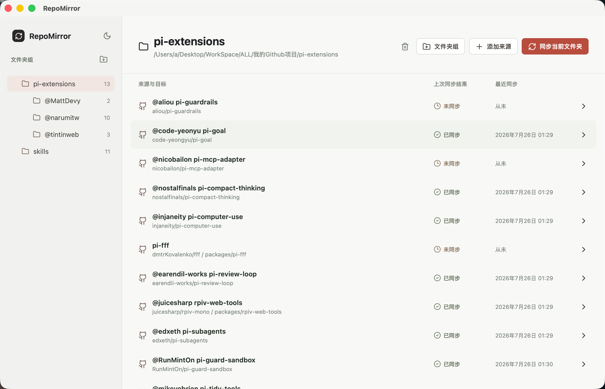
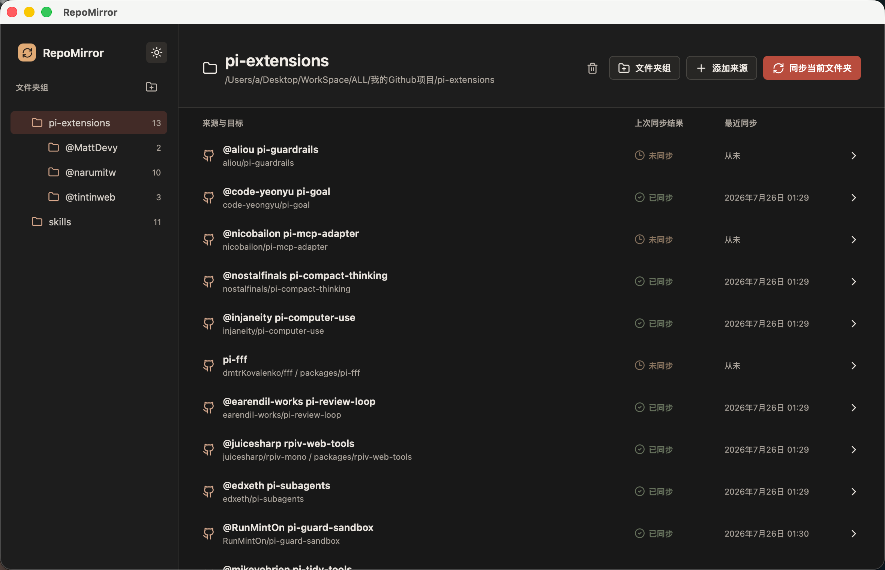

# RepoMirror

[中文文档](README.zh-CN.md)

RepoMirror is a focused macOS desktop app for mirroring a GitHub repository, or one directory inside it, into a local folder tree. It is built with Tauri 2, React, TypeScript, and a small Rust backend.

It is especially useful for people building a local library of AI agent skills, prompts, extensions, and open-source tools: keep the folders you actually use on disk, group them however you like, and stop manually checking dozens of GitHub projects for updates.





## Features

- Multiple user-selected root directories, displayed as one folder tree.
- Expandable path-based folder groups such as `tools/browser` beneath each root directory.
- GitHub repository and `tree/<branch>/<path>` directory links.
- Batch source addition and optional custom destination names.
- Per-item mirror mode, with a file-by-file preview before every write.
- Manual single-item synchronization and scope-aware batch synchronization.
- Drag a Sync Item to another root directory or folder group, with an option to move its managed local destination too.
- Config import/export, persistent light/dark appearance, and no account or token storage.

RepoMirror uses the Mac's existing `git` executable and credentials. Private repositories work when Git can already authenticate on the machine.

## Safety

Synchronizing never starts without a preview and confirmation. Mirror mode may remove files from a destination when they do not exist in the source; disabling mirror mode preserves local extra files.

`.git`, `.DS_Store`, and `node_modules` are never changed by synchronization. Deleting a root directory or Folder Group recursively removes its configuration. You may separately opt in to delete the affected managed Destinations; RepoMirror never deletes the root directory itself or unrelated local files inside it.

### How synchronization works

RepoMirror retrieves the newest commit from each configured GitHub source, then compares the source directory with that item's final destination directory. It writes only files that are new or different and leaves identical files untouched. A new GitHub commit therefore does not necessarily change local files: a commit outside the configured repository directory has no effect on that item.

The list records only three results: `Not synced`, `Synced`, and `Failed`. `Synced` means the item's most recent synchronization completed successfully; it is not a background live check of GitHub. Run a preview to fetch the source again and determine the current file-level differences. An empty preview means no synchronization is needed, and RepoMirror does not offer a confirmation action in that case.

`Sync current folder` always starts with a scope dialog. Choose either the current location only or the current location and all descendant Folder Groups; recursive scope is selected by default. A root directory scopes only the Sync Items beneath that root. Each item is handled independently at `<rootDirectory>/<folderGroup>/<destinationName>`, so unrelated local files are preserved.

With `mirror: true`, source files replace same-named local files and local files absent from the source are removed, but only inside that item's final destination directory. With `mirror: false`, files absent from the source are retained; changed source files are still updated.

## Configuration

RepoMirror stores its working configuration in the macOS application-support directory. Exported files use `schemaVersion: 3`. Version-2 configuration files are intentionally discarded rather than migrated or imported.

```json
{
  "schemaVersion": 3,
  "rootDirectories": [
    { "id": "library", "path": "/Users/you/RepoMirror Library" }
  ],
  "theme": "dark",
  "folderGroups": [
    { "rootId": "library", "path": "tools/browser" }
  ],
  "items": [
    {
      "id": "5ac18832-4c2f-4a61-a8ca-cf7b5f9c4a44",
      "sourceUrl": "https://github.com/narumiruna/pi-extensions/tree/main/extensions/pi-btw",
      "repoUrl": "https://github.com/narumiruna/pi-extensions.git",
      "branch": "main",
      "sourcePath": "extensions/pi-btw",
      "rootId": "library",
      "folderGroup": "tools/browser",
      "destinationName": "pi-btw",
      "mirror": true,
      "lastStatus": "not_synced",
      "lastSyncedAt": null,
      "lastCommit": null,
      "lastMessage": null
    }
  ]
}
```

Imports reject malformed JSON, unsupported schema versions, unknown fields, invalid paths, invalid enum values, duplicate IDs or destinations, and GitHub fields that do not agree with each other. A failed import does not alter the current configuration. When configuration already exists, RepoMirror requires an explicit overwrite confirmation before replacing it.

### Configuration Skill for Codex

This repository includes [`repo-mirror-config-skill/`](repo-mirror-config-skill), a Codex skill for creating, explaining, reviewing, and repairing RepoMirror import JSON. It converts GitHub repository or directory links into valid Sync Items, asks only for missing essentials, and checks the schema before returning a result.

Install it into your local Codex skills directory, then start a new Codex task:

```bash
mkdir -p "${CODEX_HOME:-$HOME/.codex}/skills/repo-mirror-config"
cp -R repo-mirror-config-skill/. "${CODEX_HOME:-$HOME/.codex}/skills/repo-mirror-config/"
```

Then ask Codex something like:

> Use `repo-mirror-config` to create an importable RepoMirror JSON. My root directory is `/Users/me/Extensions`; put these links under `community/tools`: `https://github.com/owner/repo` and `https://github.com/owner/repo/tree/main/packages/plugin`.

The skill also works for validating an existing export or repairing a JSON file rejected by RepoMirror. `mirror: true` remains a deliberate choice: after preview confirmation, it may remove destination files that are absent from the source.

## Development

Requirements: macOS 12+, Git, Node.js 20+, Rust, and Xcode Command Line Tools.

```bash
pnpm install
pnpm tauri dev
```

Validate the frontend and Rust backend separately:

```bash
pnpm build
cd src-tauri && cargo check
```

Create a macOS bundle with:

```bash
pnpm tauri build
```

The command first runs the production frontend build and then produces a release macOS application bundle and disk image. The usual output locations are:

```text
src-tauri/target/release/bundle/macos/RepoMirror.app
src-tauri/target/release/bundle/dmg/RepoMirror_0.2.0_<architecture>.dmg
```

On an Apple Silicon Mac, `<architecture>` is `aarch64`; on an Intel Mac, it is `x64`. The `.app` bundle can run directly, while the `.dmg` is the convenient distribution installer: open it and drag `RepoMirror.app` into Applications. Builds are not code-signed or notarized by this repository, so macOS may require an explicit first-run approval when distributing the app outside the development machine.

## Project Layout

```text
src/          React interface and Tauri command client
src-tauri/    Rust configuration, Git, preview, and sync implementation
docs/         Architecture decisions and configuration contract
```

## License

RepoMirror is released under the [MIT License](LICENSE).
